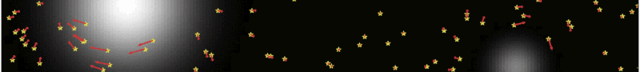

A list of selected recent papers may be found below. A full list of publications may be found on [INSPIRE](https://inspirehep.net/authors/1394493) or [ADS](https://ui.adsabs.harvard.edu/public-libraries/y66hOF7ySaKvYhjCkixRiA).

{:.no_toc}

* Will be replaced with the ToC, excluding the "Contents" header
{:toc}

## Statistical Detection of Dark Matter Substructure

The distribution of matter on small scales contains a wealth of information about the underlying particle physics and nature of dark matter. A common theme in my research has been leveraging the collective, statistical effect of a large number of small dark matter structures---subhalos---in various astrophysical systems in order to extract this information.


  <h2 class="year">{{y}}</h2>
  


## Cosmological Implications of Dark Photons

The existence of dark photons---a well-motivated extension of the Standard Model of particle physics---would leave a characteristic imprint in current and upcoming cosmological observations. I have recently explored new ways to look for signatures of dark photons in measurements of the Cosmic Microwave Background and the 21-cm line emission intensity.


  <h2 class="year">{{y}}</h2>
  


## Indirect Searches for Dark Matter

Signatures of non-minimal interaction between the standard and dark sectors can show up in a variety of astrophysical systems, with Weakly Interacting Massive Particle (WIMP) dark matter in particular producing observable signals in gamma rays. I am interested in developing new methods and search strategies to look for such signatures in gamma-ray data, using targets both in the Milky Way and beyond.


  <h2 class="year">{{y}}</h2>
  


